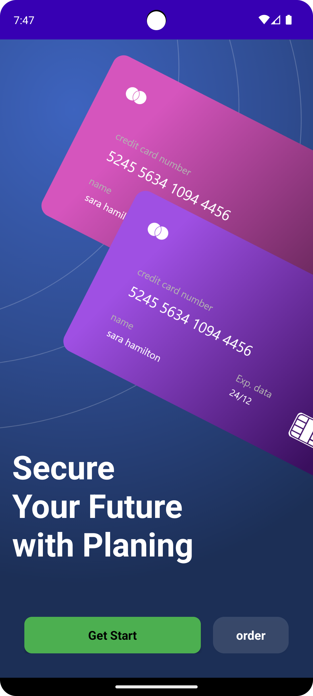
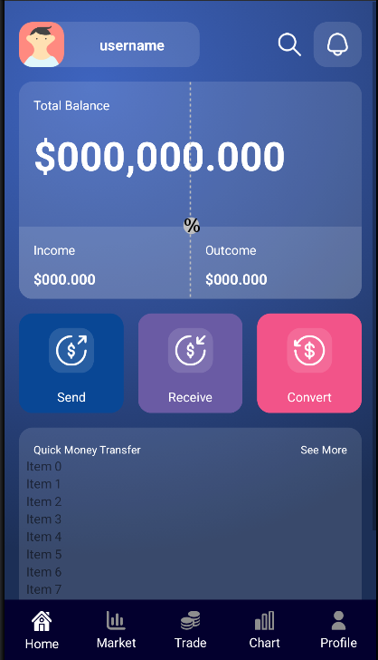

# Small Bank UI Project

This is a simple Android UI practice project for a fictional banking app.

##  Purpose

This project was created as a **UI practice task** to:
- Improve layout design skills
- Learn ConstraintLayout and Material Design components
- Experiment with visual elements like `ShapeableImageView`, margins, and theming

##  Preview

### Splash Screen  

### Dashboard Screen  

